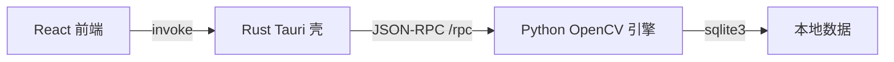

# ViSCV — 图像增强可视化软件

基于 **Tauri 2** 的桌面图像增强工具：以「可排序累积管线」对图像做连续增强，支持实时的原图/结果并排对比、直方图分析、撤销/重做、导出，以及项目/预设/笔记管理。

## 架构

「前端 + Rust 壳 + Python(OpenCV) 引擎 sidecar」三层结构：

- 前端 `src/`：React 19 + TypeScript + Vite 7 + Ant Design 6 + TailwindCSS 4。
- Rust 壳 `src-tauri/`：Tauri 2，只做桌面壳与转发，把前端的 `invoke` 转成 JSON-RPC 请求发给引擎。
- Python 引擎 `viscv_server/`：OpenCV 实现全部图像增强算子、sqlite3 本地持久化、更新检查；常驻本地 HTTP 服务，可用 PyInstaller 打包为单 exe sidecar。



## 功能

- 累积管线：任意添加/排序（鼠标拖拽）/启停/删除处理步骤，实时预览。
- 24 个增强算子（见下表），全部由 OpenCV 实现。
- 原图与当前结果并排对比（滚轮缩放、拖拽平移）+ 灰度/RGB 直方图。
- 撤销/重做；导出处理结果为 PNG。
- 项目库 / 预设库 / 笔记（Tiptap 富文本）。
- 启动时默认载入内置示例图（Lenna）；设置页支持版本更新检查。
- 深浅色主题（AntD token 统一驱动）。

## 算子一览

| 类别 | 算子 |
| --- | --- |
| 基础 | 亮度、对比度、伽马校正 |
| 颜色 | 灰度化、色彩饱和度、自动白平衡、反相、复古色调、色调分离 |
| 直方图 | 直方图均衡、CLAHE 局部均衡 |
| 滤波 | 高斯模糊、中值模糊、盒式模糊、双边滤波、降噪 |
| 细节 | 锐化 |
| 分割 | 阈值(Otsu)、自适应阈值、Canny 边缘 |
| 边缘 | 拉普拉斯边缘、Sobel 边缘 |
| 形态 | 形态学（腐蚀/膨胀/开/闭） |
| 变换 | 水平/垂直/双向翻转 |

## 快速开始

前置：Node.js ≥ 20、Rust（MSVC 工具链）、Python ≥ 3.10。

前端依赖与开发：

```bash
npm install
npm run dev          # Vite 开发服务器（http://localhost:1430）
npm run tauri dev    # 以原生桌面窗口运行
```

Python 引擎（开发时由 Rust 自动拉起，也可手动起）：

```bash
cd viscv_server
python -m venv .venv
.venv\Scripts\python -m pip install -r requirements.txt
.venv\Scripts\python -m viscv_server   # 默认 127.0.0.1:18999
```

说明：`tauri dev` 通过环境变量 `VISCV_ENGINE_PY`（Python 解释器）或 `VISCV_ENGINE_EXE`（已打包 exe）找到引擎；`VISCV_PORT`（默认 18999）、`VISCV_DATA_DIR` 由 Rust 自动传入。

打包引擎为 sidecar：

```bash
cd viscv_server
.venv\Scripts\python -m PyInstaller --onefile --name viscv-engine \
  --distpath ..\src-tauri\binaries engine_main.py
# 把 viscv-engine.exe 重命名为带 target-triple 的名字（如 viscv-engine-x86_64-pc-windows-msvc.exe）
```

## 测试

```bash
npm test                                  # 前端 Vitest
cd src-tauri && cargo test                # Rust 转发层测试
# 从仓库根目录：
viscv_server\.venv\Scripts\python -m pytest viscv_server/tests   # Python 引擎测试
```

## 目录结构

```
src/                    React 前端
  pages/                工作台/项目/预设/笔记/设置/关于
  components/ui/        统一组件层（PageCard/ParamSlider 等）
  lib/                  stores、backend 桥接、enhancements 算子目录、theme
src-tauri/
  src/engine.rs         sidecar 生命周期 + JSON-RPC 转发
  src/commands.rs       Tauri 命令（转发给引擎）
  resources/lenna.png   内置示例图
viscv_server/
  processing.py         OpenCV 算子 + 管线 + 直方图 + 编码
  storage.py            sqlite3 持久化
  updater.py            版本检查
  server.py             本地 JSON-RPC 服务（/rpc、/health）
  engine_main.py        PyInstaller 入口
```

## 接口（兼容红线）

前端命令、Step 契约（`{id,type,enabled,params}`）与返回值结构（`ImageInfo{dataUrl,width,height,histograms}`）保持不变；`commands.rs` 只做转发。改动任一侧须同步前端类型、`commands.rs` 与 `server.py` 的 `handle_command`。

更多开发约定见 [AGENTS.md](./AGENTS.md)。